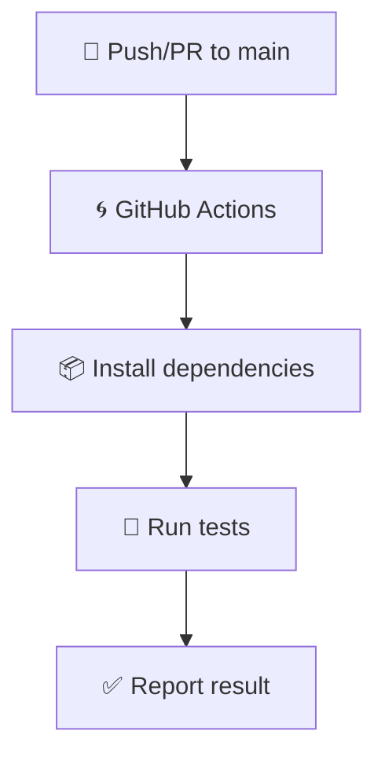

# 🧾 DevOps Test Two

<div align="center">

[](https://www.python.org/downloads/)
[](https://docs.pytest.org/)
[](https://github.com/features/actions)
[](LICENSE)

</div>

---

## 📋 Description

This project demonstrates **unit testing**, **integration testing**, and **test coverage reporting** using `pytest` for a Python coupon API.

🎯 **Main Goal:**  
Ensure robust backend logic using modern testing tools and continuous integration techniques.

---

## 🛠️ Tech Stack

| Tool              | Version | Purpose                   |
| ----------------- | ------- | ------------------------- |
| 🐍 Python         | 3.12+   | Programming language      |
| 🧪 pytest         | Latest  | Unit and integration tests|
| 🔄 GitHub Actions | -       | CI/CD pipeline            |
| 📦 pip            | -       | Dependency management     |

---

## 🏗️ Project Structure

```
devops-test-two/
├── app/
│   ├── __init__.py
│   ├── api.py
│   └── coupons.py
├── tests/
│   ├── test_api.py
│   └── test_coupons.py
├── htmlcov/               # HTML test coverage output
├── requirements.txt       # Python dependencies
├── pytest.ini             # pytest configuration
└── .github/workflows/     # GitHub Actions CI
```

---

## 🚀 Features

| Feature                  | Description                                             |
| ------------------------|---------------------------------------------------------|
| ✅ Unit Tests            | Covers coupon business logic                            |
| 🔗 Integration Tests     | Ensures proper API endpoint functionality               |
| 📊 Coverage Report       | Generates HTML and terminal coverage report             |
| 🔄 GitHub Actions        | Automated test pipeline on push/PR                      |

---

## 💻 Local Setup

### 1️⃣ Clone the Repository

```bash
git clone https://github.com/hlcxpl/devops-test-two.git
cd devops-test-two
```

### 2️⃣ Create a Virtual Environment

```bash
python -m venv .venv
source .venv/bin/activate  # or .venv\Scripts\activate on Windows
```

### 3️⃣ Install Requirements

```bash
pip install -r requirements.txt
```

### 4️⃣ Run All Tests

```bash
pytest
```

---

## 📈 Code Coverage

### Terminal Output

```bash
pytest --cov=app --cov-report=term-missing
```

### HTML Report

```bash
pytest --cov=app --cov-report=html
```

Open `htmlcov/index.html` in your browser.

---

## 🔄 CI/CD with GitHub Actions

Automated tests are triggered on push or pull requests to `main` branch via `.github/workflows`.



---

## 🧪 Testing Overview

| Test File         | Type           | Description                      |
| ------------------|----------------|----------------------------------|
| `test_api.py`     | Integration    | Validates endpoint functionality |
| `test_coupons.py` | Unit           | Checks coupon logic and rules    |

---

## 🧠 Agile Testing Principles

| Principle           | Application                                         |
|---------------------|------------------------------------------------------|
| 🔄 Automation        | End-to-end testing through GitHub Actions            |
| ⚡ Fast Feedback     | Instant detection of issues with every code change   |
| 🛡️ Regression Safety | Logic changes are caught before reaching production  |

---

## 📜 License

```
📚 Educational purpose only.
🎓 Developed as part of DevOps testing training.
```

---

<div align="center">
🛠️ Built with ❤️ for test-driven development and CI/CD practice.
</div>
